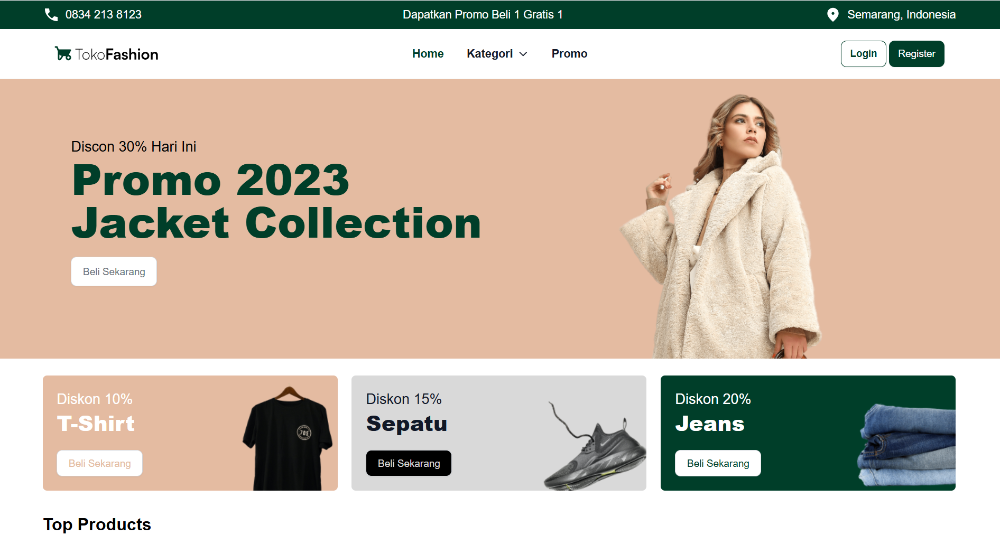

#  TokoFashion

> A modern, responsive e-commerce landing page template designed for fashion retail. Built with HTML5, styled with the utility-first power of Tailwind CSS, and enhanced with Flowbite components.



## ✨ Key Features

### 👗 User Interface (Frontend)

* **Modern Aesthetic:** Clean and minimalist design using the **Satoshi** font family for a premium feel.
* **Fully Responsive:** Optimized layout for Desktop, Tablet, and Mobile screens using Tailwind's breakpoint system.
* **Interactive Elements:** Includes carousels, dropdowns, and datepickers powered by **Flowbite**.
* **Product Showcase:** Dynamic grid layouts for showcasing fashion items (`src/assets/images/product*.png`).
* **Category Navigation:** Intuitive navigation for browsing different fashion categories.

### 🎨 Design System

* **Custom Typography:** Integrated custom font loading for `Satoshi-Variable` (Light, Regular, Bold, Black).
* **Tailwind Configuration:** Customized `tailwind.config.js` for brand-specific colors and spacing.
* **SVG Integration:** Uses optimized SVG assets for icons (Social media, UI controls) via `mini-svg-data-uri`.

## ♟️ Tech Stack

| Area | Technologies |
| --- | --- |
| **Core** | HTML5, JavaScript (ES6) |
| **Styling** | Tailwind CSS (v3.x) |
| **Components** | Flowbite UI Library |
| **Assets** | SVG, PNG, Custom Fonts (OTF) |
| **Build Tool** | NPM, PostCSS, Tailwind CLI |

## ⚙️ Installation & Setup (Local)

Follow these steps to run the project locally on your machine.

### Prerequisites

* Node.js (v16+)
* NPM

### 1. Clone Repository

```bash
git clone https://github.com/fatiya17/tokofashion.git
cd tokofashion

```

### 2. Install Dependencies

Install Tailwind CSS, Flowbite, and other dev dependencies defined in `package.json`.

```bash
npm install

```

### 3. Build & Watch CSS

Start the Tailwind CLI build process to watch for changes in your HTML/JS files and rebuild the CSS.

```bash
# This command watches `src/input.css` and compiles to `src/output.css`
npx tailwindcss -i ./src/input.css -o ./src/output.css --watch

```

### 4. Run Project

Since this is a static site, you can open `index.html` directly in your browser, or use a live server extension (like Live Server in VS Code).

```bash
# If using a local server tool (optional)
npx serve .

```

---

## 📂 Project Structure

A quick look at the top-level files and directories you'll see in this project.

```
tokofashion/
├── node_modules/      # Dependencies (Tailwind, Flowbite, etc.)
├── public/            # Static assets for deployment
├── src/
│   ├── assets/        # Images, Fonts, and SVGs
│   ├── input.css      # Main Tailwind CSS directive file
│   └── output.css     # Compiled CSS (Generated)
├── index.html         # Main Entry Point
├── package.json       # Project metadata and scripts
└── tailwind.config.js # Tailwind configuration

```

---

## ☁️ Deployment Guide

This project is static (HTML/CSS), making it perfect for **Vercel** or **GitHub Pages**.

### Vercel Deployment

1. Push the code to GitHub.
2. Import the project into Vercel.
3. **Build Settings:**
* **Framework Preset:** Other
* **Build Command:** `npm install && npx tailwindcss -i ./src/input.css -o ./src/output.css`
* **Output Directory:** `.` (Root)


4. Deploy!

---

## 🪶 Credits

Developed by **Fatiya Labibah**.

* **UI Components:** [Flowbite](https://www.google.com/search?q=https://flowbite.com/)
* **Styling Engine:** [Tailwind CSS](https://www.google.com/search?q=https://tailwindcss.com/)
* **Fonts:** Satoshi (Fontshare)
* **Resource:** [Playlist Youtube](https://www.youtube.com/playlist?list=PLIan8aHxsPj3zancAGiQ9xFMRv8JNs86n)

---

⭐ **Don't forget to star this repo if you find it useful!**

---

*© 2026 TokoFashion Project. All Rights Reserved.*